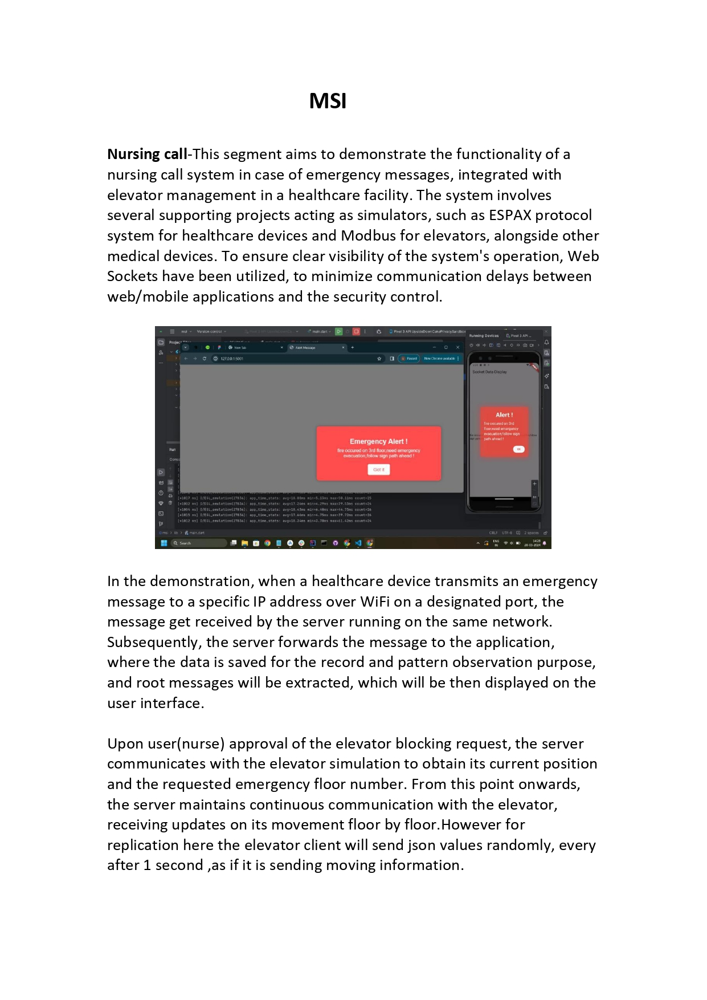
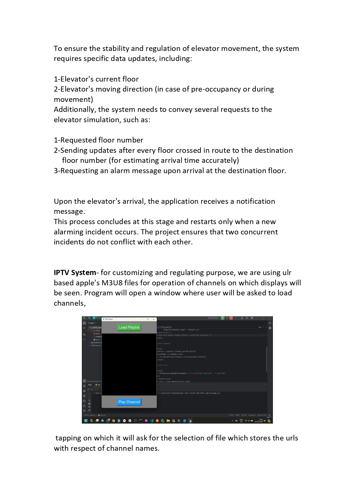
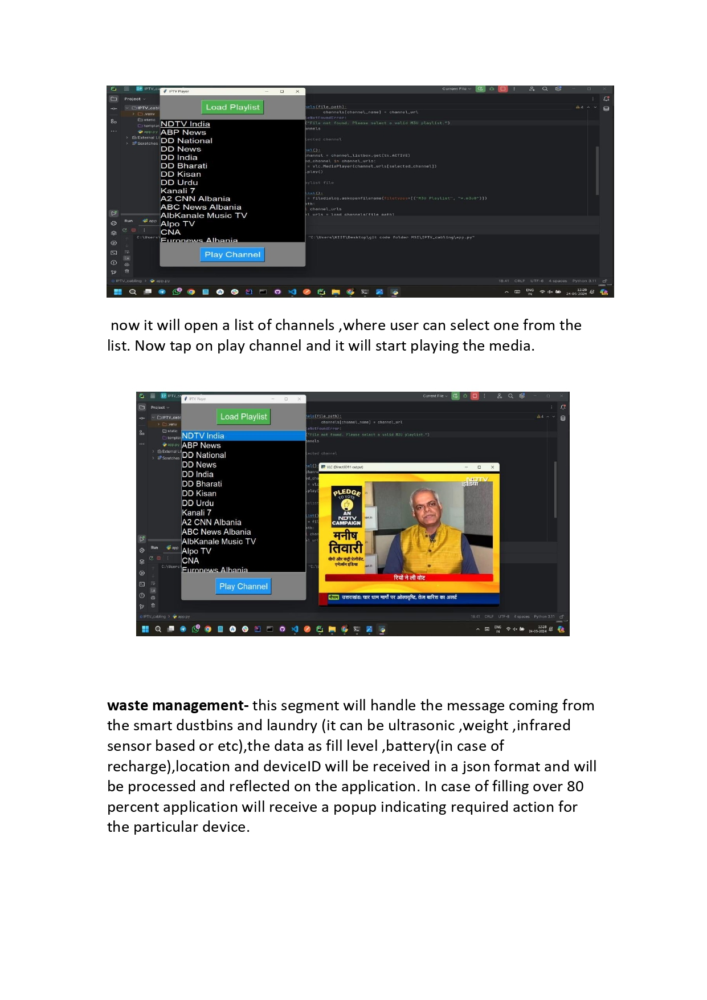
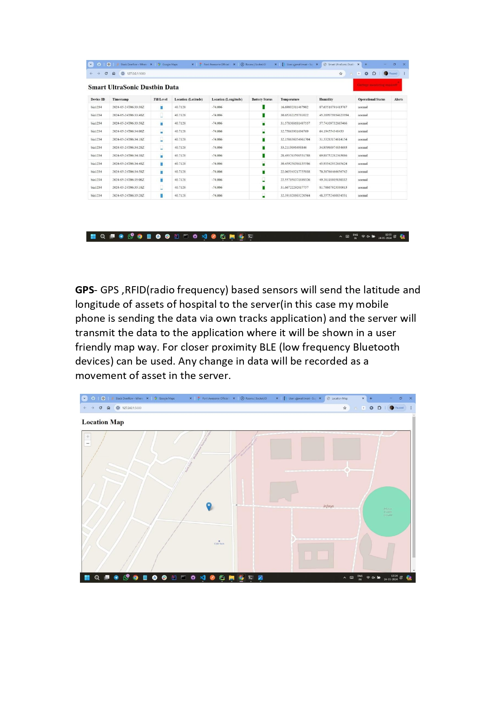
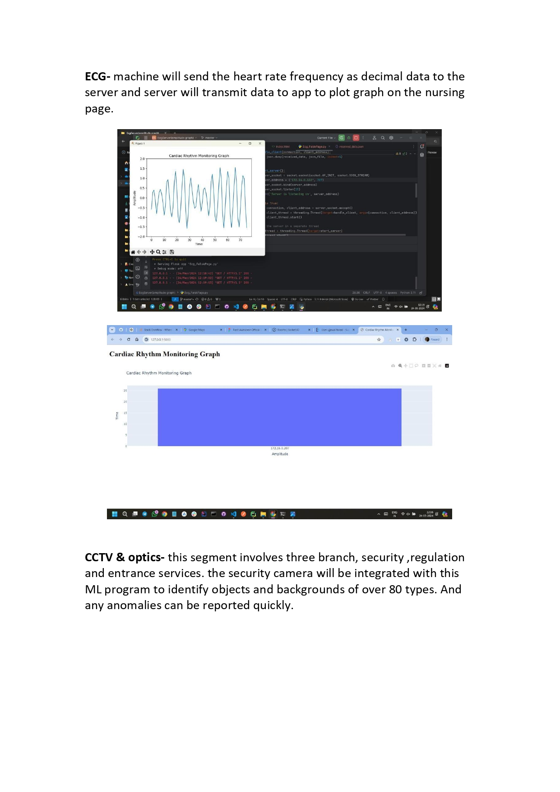
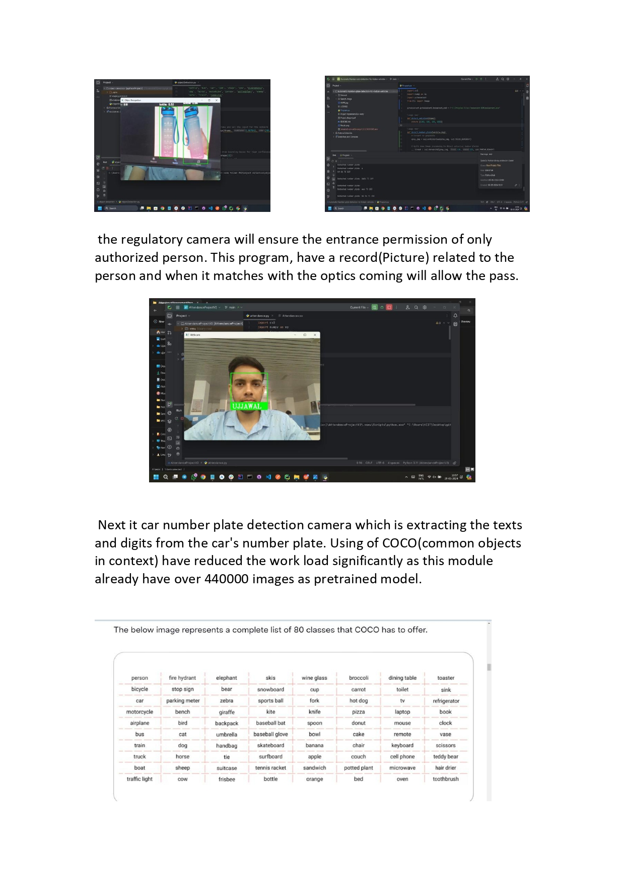
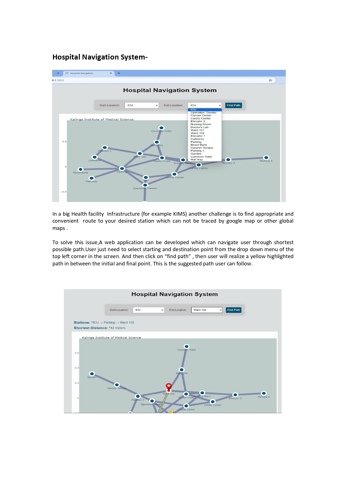
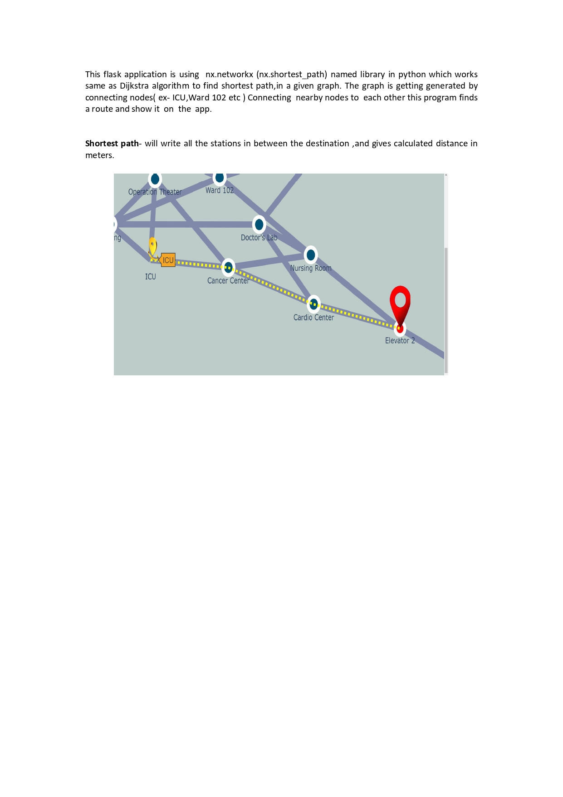

# Intro:

Master System Interation (MSI) uses AI/ML and WebSocket to create communication between software application and building infrastructure and healthcare applications by using different channels (bluetooth,wifi,usb) to reduce data lag and error and reducing human resources exchanging data in real time with the database application. The prime use of MSI is to regulate automated devices using mobile apps and web apps for example, a notification for fire alarm on your personal device or a remote heart rate or breath notification of patient's to the nurse staff or a filler alert message to laundry or cleaning services from the smart dust bags. monitoring car parking on arrival of staff or visitors. automating ducts ,air regulators or steams before arrival of tenants.

# MSI Workflow

